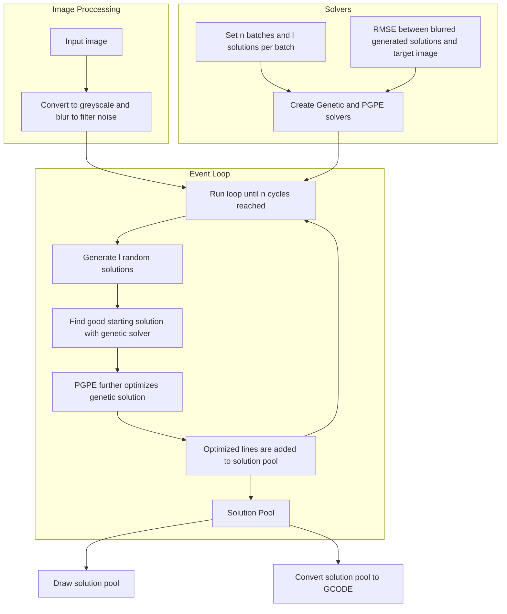

# Modern Evolutionary Art

## Introduction
Recently there has been a new burst of interest in *Genetic* and *Evolutionary Algorithms*. Modern technology has rocketed both of them far past their humble beginnings as fancy bit-flipping guessing machines, and they're now being employed in high precision and cutting edge tasks like deep reinforcement learning. While modern evolution strategies (abbreviated as *ES*) have become vital in fields involving policy gradients, a team of researchers at Google found what I think is a more interesting use for them: **creating art**.

This project builds on the paper <a href="https://arxiv.org/abs/2109.08857">Modern Evolution Strategies for Creativity: Fitting Concrete Images and Abstract Concepts</a>, and attempts to apply it's methodologies to a new task **creating drawable images out of pen-strokes**. It uses the <a href="https://people.idsia.ch/~juergen/icann2008sehnke.pdf">Policy Gradients with Parameter-Based Exploration for Control</a> evolution strategy to fit multiple batches of double shot lines to an image or concept (via CLIP), then converts those strokes to GCODE that can be printed on any compatible machine with a drawing attachment. The pipeline was heavily inspired by the paper <a href="https://www.sciencedirect.com/science/article/pii/S0921889021001974">Fast robotic pencil drawing based on image evolution by means of genetic algorithm</a>.

## Showcase
Below are a few examples of the algorithm working. On the left is the target image, the middle shows the generated output, and the right is the image as it was drawn in real life.

ADD SOME EXAMPLES HERE

## High Level Overview of the Algorithm
Multiple workflows were tested, however the most successful one behaves as follows:

The core of the algorithm is a standard, simple genetic image creator, the likes of which have been seen for  several decades now. It takes an image and "guesses" with a set of shapes, using an error function to cull the bad guesses and make more of the good ones  (<a href="https://chriscummins.cc/s/genetics/">this website</a> does an awesome job showing an interactive demo of this). The real improvements come in the use of the methods detailed below.

### The Error Function
The error function is what makes or breaks a heuristic solver. This was definitely the case for this project, and at first it didn't seem possible. Since the error space is in black and white, only one variable needs to be optimized for, that being the opacity of the line. <a href="https://www.sciencedirect.com/science/article/pii/S0921889021001974">Michal Adamik et al. 2022</a> used a spring-pressured graphite tooltip, allowing them to modulate the strength of lines and effectively create a wide range of opacities. Unfortunately, this doesn't work in this case because the opacity of pen can't be easily changed, and computers don't see patterns in images like we do (spare a few new neural networks). If we only allow full opacity lines, the solver will never reach a good approximation.

</img>
<a href="https://thepostmansknock.com/the-beginners-guide-to-crosshatching/">Source</a>

The image above shows a popular technique for shading, known as **cross-hatching**. It shows that to make a good representation of a value, you only need the the average over an area to be close to said value. So, to allow the computer to see line drawings as humans do, we simply have to blur the image before computing the error. This fixes the issue mathematically too, and converts two values (black and white) to a range depending on the size of the blurring kernel. I found that a standard mean blur gave equivalent and sometimes better results than a Gaussian blur, while taking far less time to compute.

### Better Solution Structuring
I found that there was an issue with the aforementioned paper on robotic arm controlled line drawing. The solution was arranged in the form $[x_1, y_1, x_2, y_2,  ..., x_{n-1}, y_{n-1}, x_n, y_n]$, where the $(x_{n-1}, y_{n-1})$ corresponds to the start of the line and $(x_n, y_n)$ to the end, both in pixel coordinates. Immediately, the use of pixel coordinates jumps out as strange, since that means each model's standard deviations will have to be edited to adjust for the changed pixel size. To fix this, this model normalizes the parameter space between $(0, 1]$, and all values are converted to pixel space during drawing and GCODE construction.

Even after normalization, however, I found that having each value correspond to a direct coordinate was causing issues in the form of what I call **cross lock**. Because solution values are initialized with random uniform values, it means it's a rather likely occurrence for a line to span the entire screen, which in most cases is undesired. Both the genetic and evolutionary solvers attempt to fit to the image better via small adjustments, which fails when the points are so far apart: statistically, it's just too unlikely that all the values will be changed simultaneously that will remove the line from spanning across the entire screen. Over time, this causes these spanning lines to reach both corners and create an ugly cross.

Fixing cross lock is relatively easy, and simply requires converting the solution components from cartesian to polar coordinates. It still only requires four values, which go from $[x_1, y_1, x_2, y_2]$ to $[c_x, c_y, \theta, r]$, where $c_x, c_y$ are the normalized center coordinates, $\theta$ is the angle in radians (initially $(0, 1]$ but converted to $(0, 2\pi)$) and $r$ is two times the length, since it is about the center. Additionally, this implementation multiplies $r$ by one half again to prevent any lines from taking up too much space.

### Mini Batches
In initial attempts, I followed the work of <a href="https://arxiv.org/abs/2109.08857">Yingtao Tian, David Ha, 2021</a> to optimize. Their approach involves creating a single solution vector of size $L*N$, where $L$ is the number of parameters per shape (10 for a triangle), and $N$ is the number of shapes. This single solution vector was then optimized with PGPE and the ClipUp optimizer until satisfactory. This works extremely well, however it is **extremely slow**. For every iteration, $N$ shapes must be drawn, compared, and slightly shifted upwards of hundreds of times. Downsampling the target image helps, however it is not a permanent solution. The issue is that the solution vector is simply too large for any fast optimization to happen. In this scenario, $L$ is 4, which means that drawing 100 lines (which is nowhere near enough to represent an image) creates a **400 dimensional function** for the poor algorithm to try to optimize. 

Thankfully, the line drawing task is just another rendition of gradient descent, and an exact parallel to this problem appears elsewhere in neural network training.

</img>
<a href="https://sweta-nit.medium.com/batch-mini-batch-and-stochastic-gradient-descent-e9bc4cacd461">Source</a>

The original paper is doing *batch gradient descent*, running the entire dataset through the neural network to get the gradients for the next step; this is equivalent to optimizing using every single shape to get the error for the next step. As can be seen in the diagram above, this is extremely precise, but the drawback is that many more calculations need to be done per step. 

This can be fixed by using *stochastic gradient descent*, which choses a single sample of size $N$ and computes the gradient based on that. Optimizing for a single random line at a time is exactly what <a href="https://www.sciencedirect.com/science/article/pii/S0921889021001974">Michal Adamik et al. 2022</a> did, permitting far more accurate results with far more shapes (5,000 versus 200 for Yingtao Tian and David Ha). However, as can also be seen above, this can be jittery and imprecise, and did not work well when applied to pen strokes since the algorithm could never make meaningful progress in each step. 

*Mini-batch gradient descent* proved to be the perfect compromise. The solution vector for each step is $L * N$, however $N$ is much smaller than it would be in batch descent because multiple mini-batches will be run and stacked on top of each other. It's significantly faster than batch descent, and lacks the sporadicness and jitter of stochastic descent, which is why this is also the method used most in training deep neural networks. Through loose trial and error, I found that batch sizes of 16-64 lines allowed for meaningful progress to be made each time without causing significant slowdown.

### Two Shot Optimization with Genetic and Evolutionary Strategies 
